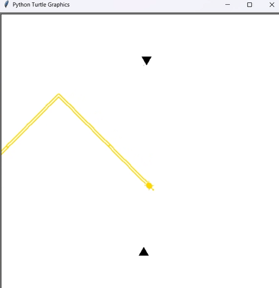

# GD-wave-on-turtle-graphics
 
Making the geometry dash wave gamemode on python turtle graphics  

External libraries used: pygame 
Installation: pip install [library name]  

## Allowed color values:
the ones listed here: https://cs111.wellesley.edu/reference/colors 
, hex color codes, and rgb codes. 

## Changelog:
v1.0 First release  
This only contain a small spam challenge and a launch pad, not too much  
v1.1 Color update  
This adds a color picker 
v1.1.1 Color error screen  
Added so that you will stop being a dumb idiot and enter a color that doesnt exist in python 
v1.1.2 Bugfixes 
Small bugfixes nobody gaf about, 3rd and prob last update today 
v1.2 Music and color update
Added music and audio, random color will be used if the color field is left empty
v1.2.1 Exe added
Added exe for automatic library installation
